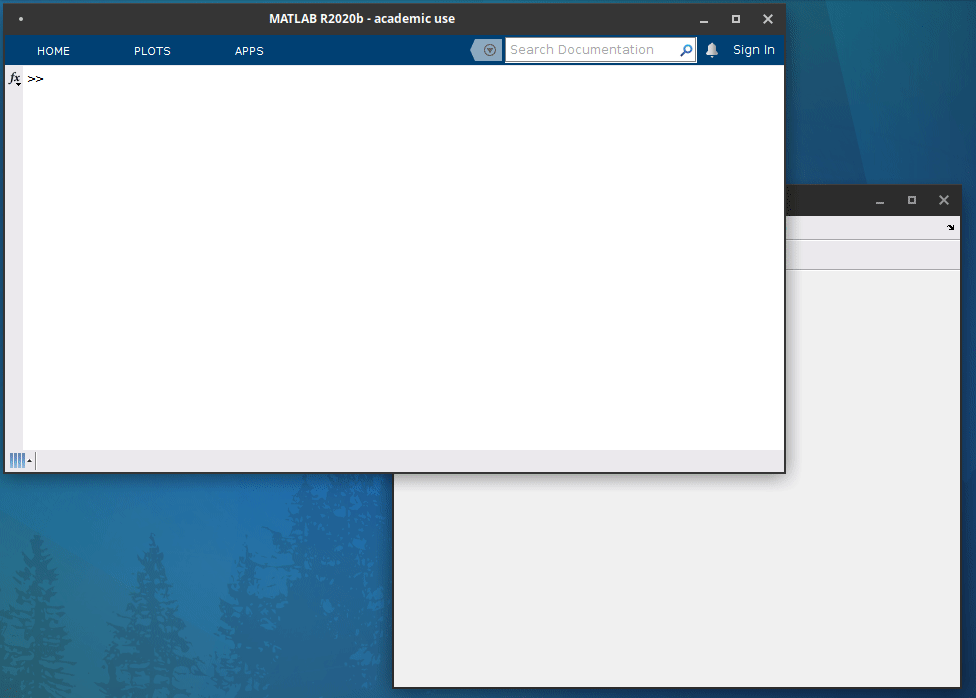

A fun application of RepLAB : solving combination puzzles
=========================================================

.. post:: 24 Jul, 2021
   :tags: puzzles, BSGS
   :category: Application
   :author: Jean-Daniel Bancal
   :location: Geneva, Switzerland
   :excerpt: 1
   :image: 1
   :nocomments:

Even though RepLAB's primary focus is on group representations, the library also includes a number of group theory primitives and algorithms. These can be used by themselves to study fun problems and even solve some puzzles!

.. figure:: https://live.staticflickr.com/65535/51332099153_57f76c750f_o_d.gif
   :alt: olympicRings
   :align: center
   :figclass: align-center responsive

   Automatic resolution of a set of Olympic rings (a timely generalization of the Hungarian rings) with the help of RepLAB

The Rubik's cube is undoubtedly the most famous symmetry-based puzzle. Its purpose? Restoring a uniform coloring of the cube's faces by applying successive rotations to parts of the articulated cube. The large number of possible configurations (43252003274489856000 in the case of the standard Rubik's cube, removing the multiplicity 24 due to the cube's global symmetry) makes the problem highly nontrivial!

Of course, cube rotations simply amount to permutations, so any cube rotation is simply a rearrangement of 6*3*3=54 colors. The 54 elements can only take one of 6 possible colors, but it is well known that this doesn't change the problem: no permutation other than the identity can leave a color arrangement unchanged.

These fun facts can all be checked explicitely by defining the corresponding permutation group with RepLAB and computing some of its properties. However, what is interesting here is that cubes of arbitrary dimension d (i.e. possibly different from 3) can also be studied for essentially the same price (except for the additional computational resource). Hence, one can easily check that the Rubik's cube of dimension 4 admits 16972688908618238933770849245964147960401887232000000000 permutations. This time, however, 95551488 of these permutations have no effect on the coloring of the cube (i.e. they are degeneracies)! Factoring the additional order 24 of the global cube's rotations, this leaves us with a total of 7401196841564901869874093974498574336000000000 possible cube configurations.

Of course, other properties of the Rubik's cube can be studied with RepLAB. For instance, it is possible to compute explicitely, at least for d=2, the equivalence classes of the group. It turns out that there are 270 in this case. Interestingly, recognizing some of these classes and the best way to solve them is one of the central idea leveraged by practical technique aiming at solving Rubik's cubes, which brings us to the main point of interest of the Rubik's cube... how to solve a Rubik's cube?

Efficient techniques have been developped to solve the standard Rubik's cube quickly. These techniques have also been generalized to arbitrary dimensions, but they become less efficient for larger cubes. In RepLAB, we can solve a Rubik's cube independently of some a priori insight about the underlying group.

Indeed, RepLAB implements BSGS chains, which provide an efficient way to find the permutation that relates two valid cube's configurations within the possibilities offered by a group. A home-improved algorithm inspired by T. Minkwitz (1998) can then be used to express this permutation as a 'word', i.e. in terms of a set of successive rotations, while taking into account cosets. We then have the guarantee that applying the corresponding physical moves will implement the desired permutation, i.e. it will solve the cube. By construction, this approach applies to arbitrary cube size and takes advantage of degeneracies to reduce the number of moves.

But enough words, let see how it looks in practice. A Rubik's cube solver following this principle is included in the new package `RepFuN <https://www.github.com/replab/repfun/>`_. Here is a demonstration of its operation:

   Interactive resolution of a 2x2x2 Rubik's cube

RepFun also includes a solver for Olympic rings which is illustrated above. Happy 2021' Olympics!

