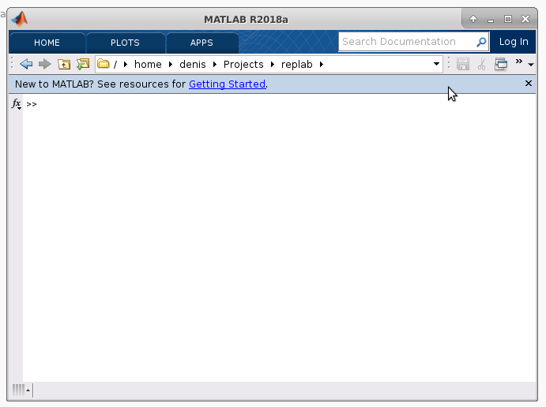
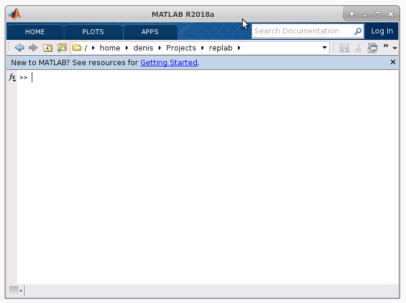

.. toctree::
   :maxdepth: 1
   :hidden:

   tutorials/index
   howto/index
   topic/index
   talks/index
   api/index
   development/index
   blog/index

Welcome to RepLAB!
==================

Current version: |version| (`GitHub <https://github.com/replab/replab>`_ / `latest release ZIP`_ / :doc:`installation instructions <tutorials/installation>`).

**RepLAB** provides tools to study representations of finite groups and decompose them numerically.
It is compatible with both MATLAB and Octave.

   Decomposition of the :math:`U \otimes U` representation of the unitary group of dimension 2.

   Integrated help system in RepLAB

How to start using RepLAB?
--------------------------

Have a look at the :doc:`tutorials <tutorials/index>`!
They have everything to get you started, from installation instructions to hands-on examples.

The documentation of **RepLAB** is organized along 4 directions, following this `approach <https://www.divio.com/blog/documentation/>`_:

-  :doc:`Tutorials <tutorials/index>`: are short hands-on presentations that give you a taste of the goodness of **RepLAB**
-  :doc:`How-to guides <howto/index>`: are concise recipes that show you how to achieve a specific goal
-  :doc:`Topic guides <topic/index>`: are understanding-oriented presentations that explain the big picture and the key notions on which this software is built
-  :doc:`Technical reference <api/index>`: contains a complete and accurate description of each object of the library

Work in progress
----------------

**RepLAB** is a work-in-progress. In particular:

- RepLAB works in double floating-point precision.
- We are still working on the estimation/control of numerical errors (a few criteria are currently hard-coded).
  That said, **RepLAB** works fine for representations of medium size ($d$ equal to a few thousands).
- While RepLAB has a basic implementation of computational group theory algorithms, it does not offer much to work with groups.
- Construction of representation by images (`replab.RepByImages`) should be done only with matrices that can be represented exactly in floating-point arithmetic, as errors accumulate quickly otherwise (in most of our cases, we use signed permutation matrices which are fine).

Why RepLAB?
-----------

Because no open source library exists to decomposes arbitrary permutation/monomial representations into irreducible representations over the reals. RepLAB implements numerical methods that perform this decomposition up to machine precision.

That said, other libraries working on the same problem space include:

-  The `GAP System 3 package AREP <https://www.gap-system.org/Gap3/Packages3/arep.html>`_ by
   Sebastian Egner and Markus Püschel.

-  `NCSOStools <http://ncsostools.fis.unm.si/documentation/awbd>`_ includes an implementation of the Murota-Kanno-Kojima-Kojima-Maehara algorithm to decompose matrix \*-algebras.

Contributors
------------

RepLAB and the group theory/linear algebra libraries it depends on were
initiated by `Denis Rosset <https://github.com/denisrosset>`_ and
`Jean-Daniel Bancal <https://github.com/jdbancal>`_. The project has
now more `contributors <https://github.com/replab/replab/graphs/contributors>`_.

RepLAB references in the ``/external`` directory the following libraries: the `MOxUnit <https://github.com/MOxUnit/MOxUnit>`_ test framework by Nikolaas N. Oosterhof, the `MOcov <https://github.com/MOcov/MOcov>`_ code coverage report generator by Nikolaas N. Oosterhof, the `YALMIP <https://github.com/yalmip/YALMIP>`_ toolbox for optimization modeling by Johan Löfberg, the `SDPT3 <https://github.com/sqlp/sdpt3>`_ solver, and the `VPI <https://www.mathworks.com/matlabcentral/fileexchange/22725-variable-precision-integer-arithmetic>`_ big integer library by John D'Errico.

Feedback and suggestions are always welcome. We ask participants to follow the guidelines of the `Typelevel Code of Conduct <https://typelevel.org/conduct.html>`_.

License
-------

RepLAB is (C) 2018-2020 Denis Rosset, Jean-Daniel Bancal and other collaborators, and licensed under the `Mozilla Public License 2.0 <https://github.com/replab/replab/LICENSE>`_.
